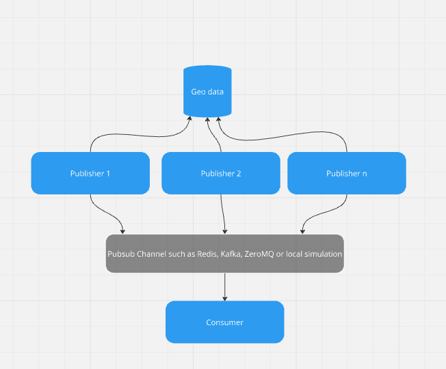
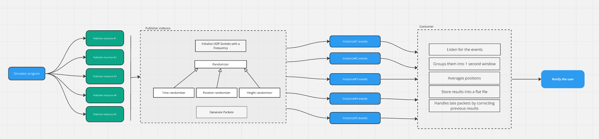

 # GeoData aggregator - Fugro interview excersice

## Task Description:  Implement two applications using Python. 

The first application can be run in multiple instances and every instance is publishing packets with a geographic position every few seconds in broadcast. Each instance has its own frequency of spreading packets (can be random from 1.01 second to 5 seconds). The position is random but remains within the Netherlands boundaries (find and assume some maximum and minimum latitude and longitude for the Netherlands). 
 
The second application is intended to consume data from all available instances. It is performing averaging of retrieved positions (average latitude, average longitude, average height) if they are within a second. Note that the time span of the aggregated record for the received packets can be maximum 1 second between the first (oldest) and last (newest) packet. Therefore if the coming packet contains a position with time later than that time span, it goes to the next aggregated record.  The averaged result should be put to a local storage file or printed out to the console output.  Note that due to possible network issues (assume it is simulated for this exercise) a packet from one of the instances may arrive later than expected. In this case the averaging has to be corrected for previously printed aggregated records and the user has to be notified as well.

## Understanding

We need to create two applications one act as publisher, second one as consumer.

Publisher is responsible to broadcast packets of random NL range Geo Data at a random time inteval from 1.01 till 5 seconds.

Consumer is responsible to listen and process the events published by multiple publisher instances, aggregates to maximum of 1 second, if its later then one second, then it will be next record. 
Result is stored in a flat file. Due to possible network issues, a correction mechanism is implemented for previously saved aggregated records. The user is notified with a message on the console about the progress of the program.

A Sample program to start the publisher with n number of instances and start the consumer 

## Design and Implementation

https://miro.com/app/board/uXjVLl6J6ho=/?share_link_id=90043539765

The system at high level works as shown in the picture below.

Publishers uses randomized geo data within NL boundaries and publishes as series of events

Publishing channel can be Redis, Kafka, ZeroMQ or equavalent

Consumer continuously listens to the events and process it.

A simulater program is for the exercise purpose to launch the multiple instances of the publisher and to start the consumer

Publisher:
- Initialize sockets with a unique frequency
- Randomizers for timer, position and height
- Generate the packets
- Publish events continously on random time interval

Consumer
- Contiously listen to the events 
- Groups them into 1 second interview
- Averages poistions
- Stores results into a flat file
- Handles late packets by correcting previous results
- Notify

Sample test executions:

Publishers triggered with 5 instances

Consumer

results are stored in a log file

